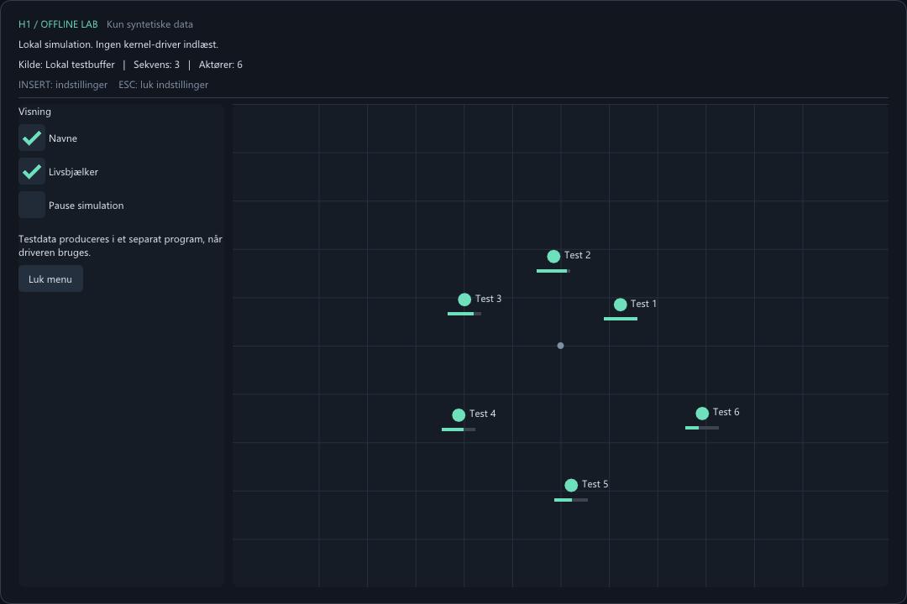

# Offline Lab

Dette er den aftalte afgrænsede testversion: syntetiske data ind og ud af en
driver-ejet buffer. Den læser ingen spilproces og har ingen funktion til at
omgå procesbeskyttelse. Der er ingen proces-id'er, adresser eller brugerpointere
i protokollen.

## Prøv visningen nu

Åbn `../dist/offline/Release/offline_lab.exe`.

Standardtilstanden viser seks bevægelige testaktører, navne og livsbjælker i et
selvstændigt vindue med samme DirectX/ImGui-teknik som den eksisterende GUI.
**INSERT** åbner/lukker indstillinger. **Esc** lukker indstillingerne.
Det kræver hverken spil, administratorrettigheder eller en indlæst driver.

Standardtilstanden bruger en lokal buffer i programmet og kalder den samme
pakkehåndtering som driveren. Den er tydeligt mærket **Lokal simulation**;
den er ikke en påstand om, at der er kørt kernel-kode.



## Komponenter

| Fil | Rolle |
|---|---|
| `Protocol.h` | Fælles ABI og validering af pakker |
| `driver/Driver.c` | WDM-kerneldriver med egen låst buffer |
| `Client.h` | Afgrænset `DeviceIoControl`-klient og generator af testdata |
| `Console.cpp` | Separat producent/læser af syntetiske data |
| `View.cpp` | Visning af lokale data eller data fra testdriveren |
| `Tests.cpp` | Validering af protokol og fejlsituationer |

`../dist/offline/H1OfflineLab.sys` er en bygget, **usigneret x64-driver**.
Den er ikke installeret eller indlæst på denne computer. Der er ikke ændret
Windows-startindstillinger, installeret certifikater eller startet en mapper.

## Forløb med en indlæst testdriver

```text
offline_client publish
    -> LAB_PUBLISH / METHOD_BUFFERED
    -> H1OfflineLab.sys: validering + egen buffer
    -> LAB_READ / METHOD_BUFFERED
    -> offline_lab --driver: visning
```

Den faktiske driverkørsel er næste integrationskontrol i en isoleret Windows-test-VM
med normal driversignering og WDK-deployment. Se Microsofts dokumentation om
[testsignering af drivere](https://learn.microsoft.com/en-us/windows-hardware/drivers/install/test-signing)
og [WDK fra NuGet](https://learn.microsoft.com/en-us/windows-hardware/drivers/install-the-wdk-using-nuget).
Dette projekt indeholder ingen funktion til at tilsidesætte signaturkontrol.

Når den korrekt signerede testdriver er installeret og indlæst i VM'en, køres
følgende fra `dist/offline/Release` i separate administrator-terminaler:

```powershell
# Producer syntetiske data i 60 sekunder:
.\offline_client.exe publish 60

# Vis data fra driverens buffer:
.\offline_lab.exe --driver

# Eller læs én pakke til konsollen:
.\offline_client.exe read
```

Kun SYSTEM og administratorer har adgang til driverens enhedsobjekt.
Læse-IOCTL kræver læseadgang; publicering kræver skriveadgang.
Ved manglende driver vises en Windows-fejlkode; programmet skifter ikke skjult
til simulation. Driver-visningen publicerer ikke selv data; producenten skal køre.
Den sidste publicerede pakke bliver i bufferen, indtil den erstattes eller driveren
aflæses. Sekvensnummeret gør det synligt, hvis producenten er stoppet.

## Protokol

- Fast version 1 og præcis pakkestørrelse: 1.552 bytes.
- Højst 32 aktører med millimeterkoordinater, id, navn og health 0–100.
- Et stigende sekvensnummer ejes af driveren; producentens nummer ignoreres.
- Hele pakken valideres, før den publiceres.
- Ugyldige versioner, længder, navne, værdier og dublerede id'er afvises.
- Ubrugte bytes og aktører nulstilles.
- Read/publish synkroniseres med en spinlock. Ingen flydende tal anvendes i kernel.
- I/O managerens `SystemBuffer` bruges gennem
  [buffered I/O](https://learn.microsoft.com/en-us/windows-hardware/drivers/kernel/using-buffered-i-o).
- Enheden oprettes med `IoCreateDeviceSecure` og
  [SYSTEM-/administrator-ACL](https://learn.microsoft.com/en-us/windows-hardware/drivers/kernel/sddl-for-device-objects).

## Byg

Fra hovedmappen `andensourcekode`:

```powershell
.\build.ps1
.\offline\driver\build-driver.ps1
```

Første kommando bygger brugerprogrammerne og kører de fem lokale testgrupper.
Anden kommando bygger driveren med Visual Studio x64 og den fastlåste Microsoft
WDK NuGet-pakke `10.0.26100.1`; pakkens SHA-256 kontrolleres ved download.
Den bruger Windows SDK `10.0.26100.0`, som allerede findes på maskinen.
Scriptet kompilerer og linker kun; det installerer eller indlæser ikke driveren.

## Verificeret 2026-09-29

- Brugerprogrammer bygget med advarsler behandlet som fejl.
- Kernel-driver bygget med `/kernel`, `/GS`, `/W4` og `/WX`.
- Alle fem lokale testgrupper bestået, herunder 17 protokolchecks.
- Offline-visningen er renderet i et skjult vindue og visuelt kontrolleret.
- Konsolklienten giver en forståelig fejl, når driveren ikke er indlæst.
- Driverens imports er inspiceret; ingen API'er til at læse andre processer bruges.

**Ikke verificeret endnu:** indlæsning/aflæsning i kernel, den faktiske IOCTL-rute
i en VM, samtidige klienter, enheds-ACL under Windows eller Driver Verifier.
Lokale protokoltests erstatter ikke disse integrationskontroller.
